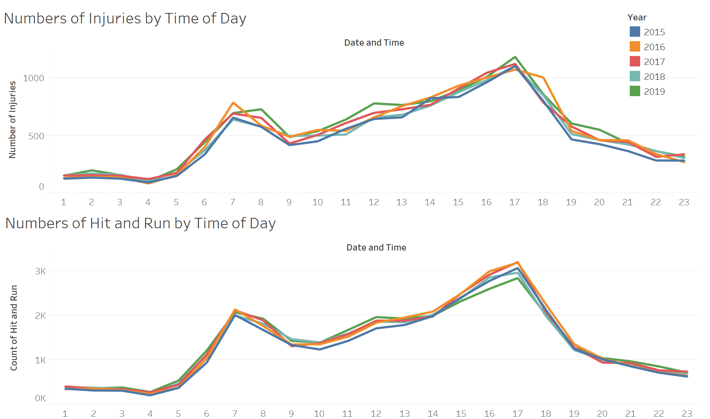

# MusicCityMayhem

##### img source https://perimeterpark.net/
## Dataset

This dataset is compiled from the Metro Nashville Data website. Below you will find links to the datasets.

* [2015 Traffic Data](https://data.nashville.gov/Police/Traffic-Accidents-2015-/usum-h3s3)
* [2016 Traffic Data](https://data.nashville.gov/Police/Traffic-Accidents-2016-/p8j3-w8wi)
* [2017 Traffic Data](https://data.nashville.gov/Police/Traffic-Accidents-2017-/v6ss-vxgd)
* [2018 Traffic Data](https://data.nashville.gov/Police/Traffic-Accidents-2018-/8kay-6qhc)
* [2019 Traffic Data](https://data.nashville.gov/Police/Traffic-Accidents-2019-/abyc-w6mc)

---

## Processing
Using Pandas we read in the individual csv files and found discrepancies in column names. We renamed the columns that didn't match, added a Year column for easy sorting, and merged the datasets into a single [csv](data/Accidents_2015-2019) that can be found in the "data" folder. 

------

## Goal Ideas
* Predicting accidents based on a zip code's median income
* Predicting fatalities based on population increase
* Predicting accidents based on population density
* Construction?
* Highway accidents vs neighborhood accidents vs city accidents
* Predicting likelihood of crash depending on time of day
* Seeing if weather impacts the severity of an accident

------

## Check out the Tableau Workbook
You can find it [here](https://public.tableau.com/views/FinalProject_15976006144640/Dashboard1?:language=en&:display_count=y&publish=yes&:origin=viz_share_link)

----------

## Machine Learning

Using logistic and linear regression machine learning algorithms, we were unable to find an accurate prediction of injuries or fatalities per accident. Unfortunately the amount of data we have is insufficient to create accurate predictions.

-----

## Accidents // Fatalities per Day

Using Tableau we placed each recorded accident on a map of Nashville. The circles get larger when there are a larger number of injuries, and they go from green to red when the number of fatalities increases.

When hovering over the day portion of the dashboard, it will filter the map to show the reported accidents. 

You can toggle between the years to see common trouble spots. 

We found that the relationship between Fatalities and Injuries was 0.82% between 2015 and 2019

-----

## Number of Injuries/Hit and Run by Time of Day

The third dashboard compares the number of accidents involving injuries and hit/run incidents. Year-by-year comparisons clearly show direct correlation between these two metrics, with higher numbers of accidents peaking during morning and evening rush hours. 

We found proof of something we already had suspected. The likelihood of an accident is greatest during the daily rush hour periods

-----

## Illumination and Weather Effects

The fourth dashboard addresses illumination and weather effects. Based on these metrics, the vast majority of accidents occurred during daylight hours when the weather was clear.

-------

## Accidents Overview by Zip Code

The final dashboard shows the accident count by zip code. The areas in green had the fewest accidents, while the red areas had the most accidents. This trend was consistent during the entire period. Additionally, the majority of the accidents happened along Interstate 24, likely stemming from the population growth in those areas and the increased traffic.

-----------

## CONCLUSIONS 

1)	We do not have enough data to accurately predict the number of accidents resulting in injuries or fatalities. The available data sets are unbalanced and are skewed toward accidents with no injuries

2)	The number of fatalities were relatively low compared to total injuries (0.82%) between 2015 and 2019

3)	The likelihood of an accident is greatest during the daily rush hour periods

4)	Most accidents occurred during daylight hours when the weather was clear

5)	Zip code areas along Interstate 24 were most prone to accidents from 2015 to 2019 due to population growth and increased traffic    
